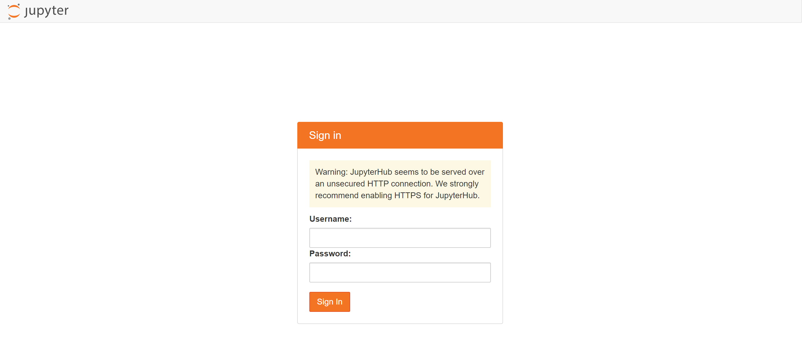
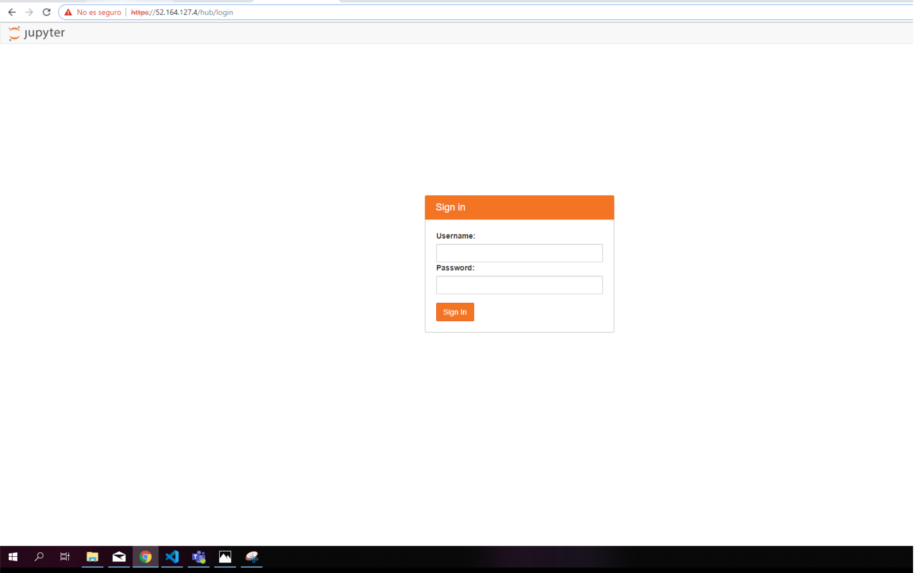

# Jupyter Server Linux Ubuntu 18.04-LTS

&nbsp;
&nbsp;

&nbsp;
&nbsp;

&nbsp;
&nbsp;

This template deploys a **Jupyter Server** using a Ubuntu Linux VM. This will deploy a CPU or GPU based VM in the resource group location and will return the admin user name, Virtual Network Name, Network Security Group Name and FQDN.  

If you are new to Azure virtual machines, see:

- [Azure Virtual Machines](https://azure.microsoft.com/services/virtual-machines/).
- [Azure Linux Virtual Machines documentation](https://docs.microsoft.com/azure/virtual-machines/linux/)
- [Template reference](https://docs.microsoft.com/azure/templates/microsoft.compute/allversions)
- [Quickstart templates](https://azure.microsoft.com/resources/templates/?resourceType=Microsoft.Compute&pageNumber=1&sort=Popular)
- [Microsoft learn](https://docs.microsoft.com/en-us/learn/modules/interactive-deep-learning/)

If you are new to template deployment, see:

[Azure Resource Manager documentation](https://docs.microsoft.com/azure/azure-resource-manager/)

## Usage

Before start using the Jupyter Server, you will need to think about how many users will connect to the VM.

The virtual machine can be scaled up depending on your subscription to a larger machine if you need it.

It is recommended 1 GB of memory per user if you are using a CPU based VM and 2 GB of memory per user if you are using a GPU based virtual machine.

i.e. if you want a CPU based VM to be used by 8 users, you will need a VM with 8 GB of memory.

### Connect

To connect with our JupyterHub, you will need to copy the Public IP address of your virtual machine, and trying to access it with a browser.

Note that accessing the JupyterHub will fail until the installation is complete, so if you just created it, be patient.

When the installation is complete, it should give you a JupyterHub login page:

Login using the admin username you typed at the time of creating the virtual machine and the password.

### Post Deployment Steps

To set up our connection via HTTPS, you will need to type some commands into the Linux Shell Script of the virtual machine.
Let's go to the resource, and enter on the **Run command** section.

Now, click on the [RunShellScript] button. You will need to introduce the next commands to configure the HTTPS.

**sudo tljh-config set https.enabled true**
**sudo tljh-config set https.letsencrypt.email <you@example.com>**
**sudo tljh-config add-item https.letsencrypt.domains <domain.PublicIP>**
**sudo tljh-config reload proxy**

Where **you@example.com** is your email address and **domain.PublicIP** is the domain where your hub will be running.
Here is an example of how it should look like:

After that, let's press the [Run] button. If we visit our **public IP** where our Jupyter-Hub is been running, we will see something like that:

`Tags: Azure4Student, virtual machine, Linux, Ubuntu Server, Beginner, Jupyter`
