# Azure Blockchain Service

The purpose of this ARM Template is deploy a **Blockchain Service**.

But let's understand a bit better how all this will work.

## Overview

### What is Azure Blockchain Service

Azure Blockchain Service is a fully managed ledger service that enables users the ability to grow and operate blockchain networks at scale in Azure. By providing unified control for both infrastructure management as well as blockchain network governance, Azure Blockchain Service provides:

- Simple network deployment and operations
- Built-in consortium management
- Develop smart contracts with familiar development tools

Azure Blockchain Service is designed to support multiple ledger protocols. Currently, it provides support for the Ethereum Quorum ledger using the IBFT consensus mechanism.

These capabilities require almost no administration and all are provided at no additional cost. You can focus on app development and business logic rather than allocating time and resources to managing virtual machines and infrastructure. In addition, you can continue to develop your application with the open-source tools and platform of your choice to deliver your solutions without having to learn new skills.

### Concepts

#### Azure Blockchain Service Consortium

Using Azure Blockchain Service, you can create private consortium blockchain networks where each blockchain network can be limited to specific participants in the network. Only participants in the private consortium blockchain network can view and interact with the blockchain. Consortium networks in Azure Blockchain Service can contain two types of member participant roles:

 -**Administrator** - Privileged participants who can take consortium management actions and can participate in blockchain transactions.
 -**User** - Participants who cannot take any consortium management action but can participate in blockchain transactions.

Consortium networks can be a mix of participant roles and can have an arbitrary number of each role type. There must be at least one administrator.

#### Azure Blockchain Service security

Azure Blockchain Service uses several Azure capabilities to keep your data secure and available. Data is secured using isolation, encryption, and authentication.

##### Isolation

Azure Blockchain Service resources are isolated in a private virtual network. Each transaction and validation node is a virtual machine (VM). VMs in one virtual network cannot communicate directly to VMs in a different virtual network. Isolation ensures communication remains private within the virtual network.

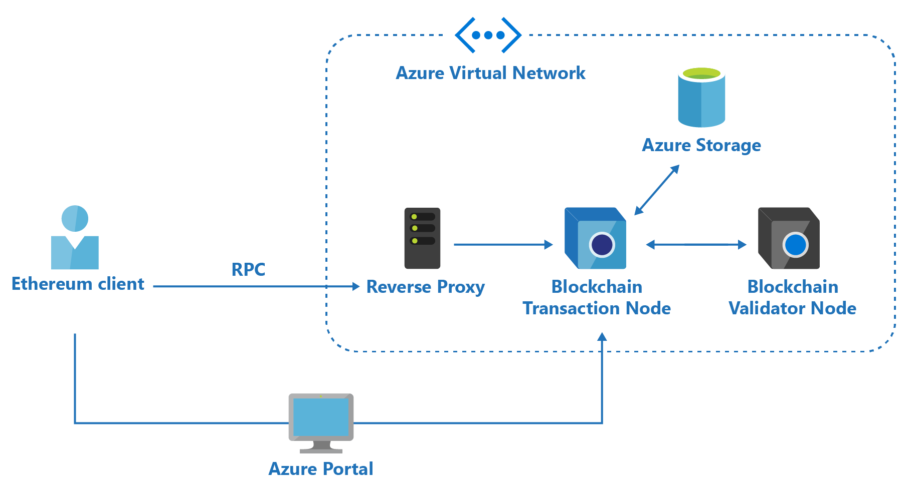

#### Encryption

User data is stored in Azure storage. User data is encrypted in motion and at rest for security and confidentiality. For more information, see: [Azure Storage security guide.](https://docs.microsoft.com/en-gb/azure/storage/common/storage-security-guide)

#### Authentication

Transactions can be sent to blockchain nodes via an RPC endpoint. Clients communicate with a transaction node using a reverse proxy server that handles user authentication and encrypts data over SSL.

#### Keys and Ethereum accounts

When provisioning an Azure Blockchain Service member, an Ethereum account, public, and private key pair are generated. The private key is used to send transactions to the blockchain. The Ethereum account is the last 20 bytes of the public key's hash. The Ethereum account is also called a wallet.

Now that you got a good idea of how the service works, let's dig on the template file.

## The Template

Don't let the size of the template scares you. The structure is very intuitive and once that you get the gist of it, you will see how much easier your life will be deploying resources to Azure.

These are the parameters on the template, most of them already have values inserted, the ones that you need to inform are: **bcMemberName** and **memberPassword**.

Here is the full list parameters in this template:

Parameter         | Suggested value     | Description
:--------------- | :-------------      |:---------------------
**blockchainMemberName** |*yourname*-*organization* i.e.:  krisnatagoras-mseducation  | Blockchain member name.
**memberPassword**  | Complex password|"Password for the BlockChain Administrator. The password must be at least 12 characters long and have a lower case, upper characters, digit and a special character (Regex match)
**Location**| One of these Locations | "eastus", "southeastasia", "westeurope", "northeurope",  "westus2", "japaneast"

## Deployment

There are a few ways to deploy this template.
You can use [PowerShell](https://docs.microsoft.com/en-us/azure/azure-resource-manager/resource-group-template-deploy), [Azure CLI](https://docs.microsoft.com/en-us/azure/azure-resource-manager/resource-group-template-deploy-cli), [Azure Portal](https://docs.microsoft.com/en-us/azure/azure-resource-manager/resource-group-template-deploy-portal) or your favorite SDK.

For Azure CLI I'm using the Visual Code with Azure CLI extensions. If you would like you can find more information [here](https://code.visualstudio.com/docs/azure/extensions). But bare in mind that you don't need to use the Visual Code app, you can stick with the always present **Command Line** on Windows or the Linux **bash terminal**.

### Using Azure CLI with Visual Code

In the terminal window type: **az login**

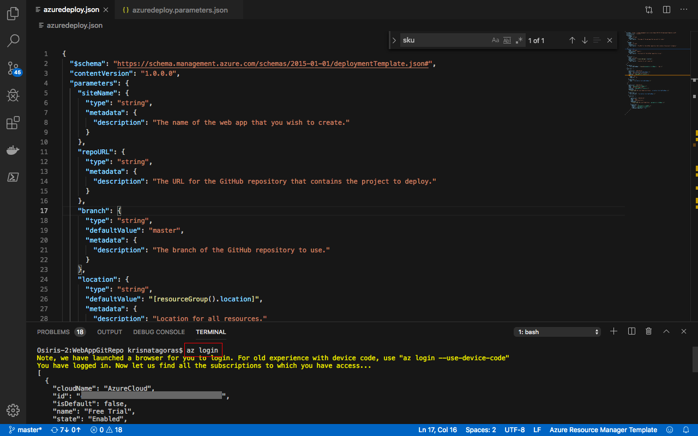

You will be redirected to the Azure Portal in your web browser where you can insert your credentials and log in.

After logging in, you will see your credentials on the terminal.

To set the right subscription, type following command:

#### az account set --subscription "your subscription id"

### Resource Group

Now you need a Resource Group for our deployment. If you haven't already created a Resource Group, you can do it now. If you are new to Azure and wonder what is a Resource Group? Bare with me! A Resource Group is a container that holds related resources for an Azure solution. The resource group includes those resources that you want to manage as a group. Simply saying: it's like a folder that contains files. Simple as that.

To create a Resource Group, you need a name and a location for your Resource Group.

For a list of locations, type: **az account list-locations**

The Blockchain Service isn't yet available for all locations. Check the availability of locations [here](https://azure.microsoft.com/en-gb/global-infrastructure/services/?products=).

To create the Resource group, type the command:

#### az group create --name "resource-group" --location "your location"

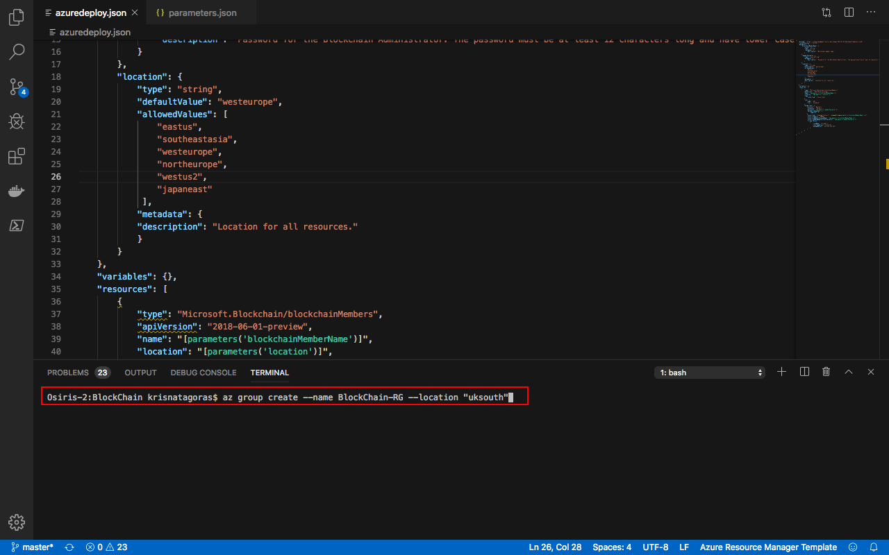

Super simple, right? Now that we have our **Resource Group** created, let's deploy the the BlockChain Service.

#### az group deployment create --name "name of your deployment" --resource-group "resource-group" --template-file "./azuredeploy.json"

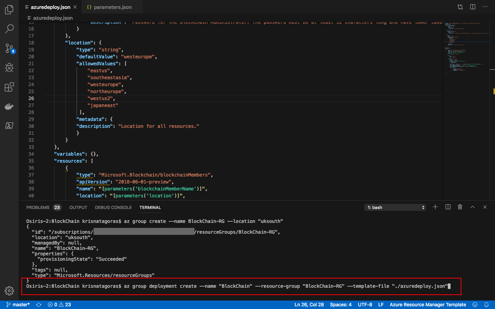

Insert the values for the parameters.
As you can see, it's running.

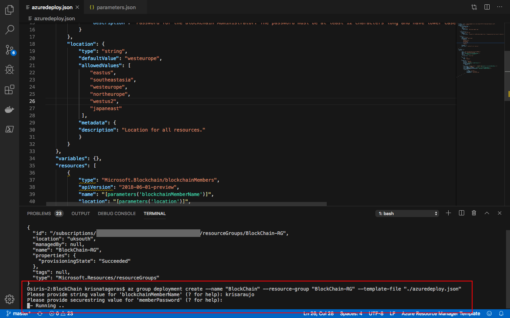

Go grab a cup of coffee, have some fresh air. Before you come back you will have your BlockChain Service.

And there we go, your deployment has Succeeded:

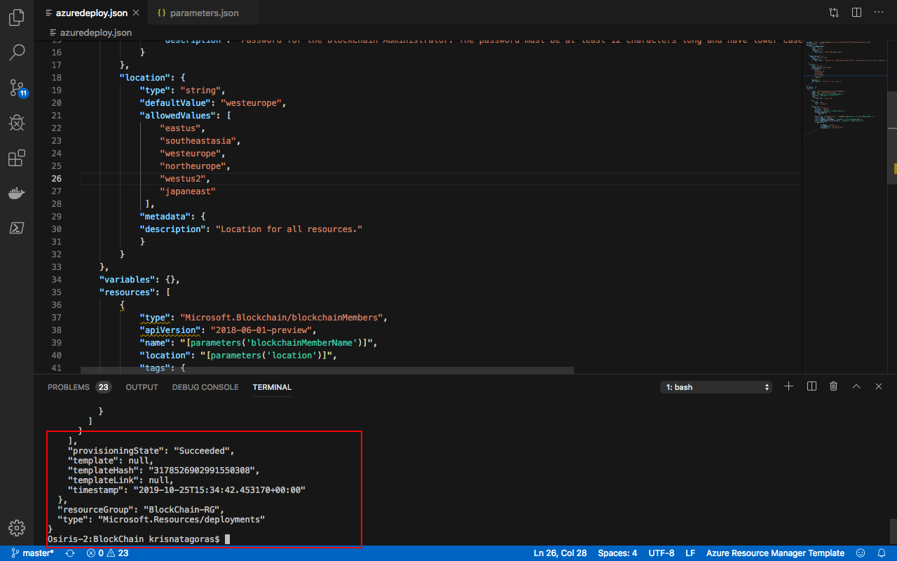

Let's check the resource in the [Azure Portal](https://portal.azure.com).

On the portal, navigate to Resource Groups. On this blade, you can see the Resource Group we've created.

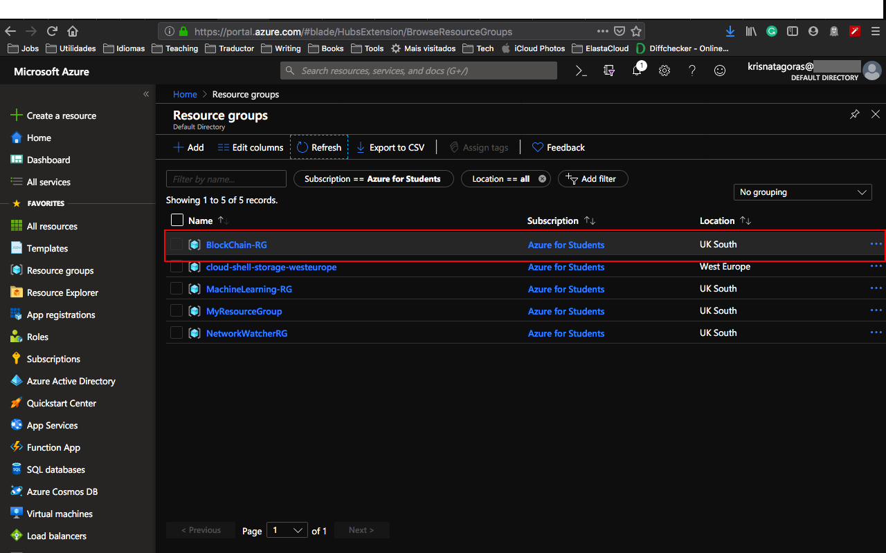

Click on the Resource Group to expand and show the **Resources**:

- Azure Blockchain Service

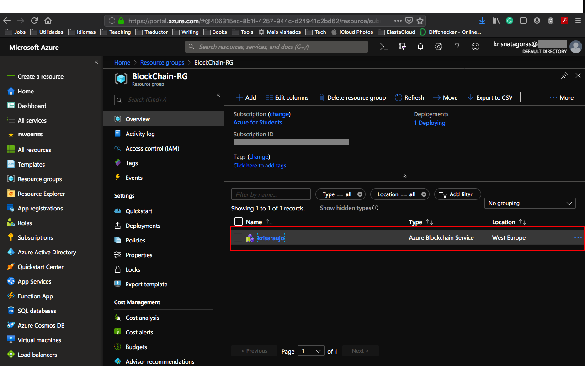

Click on the **Azure Blockchain Service** with your name, and on the next page, you have an overview of the service.

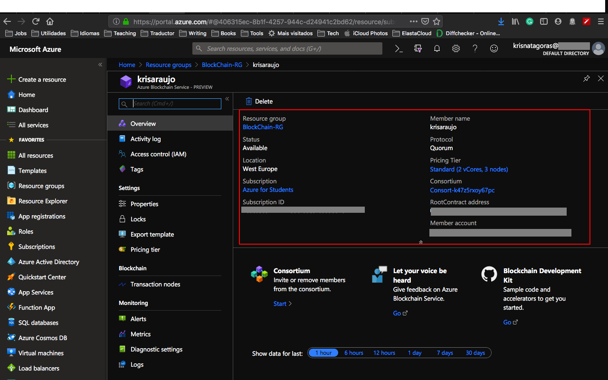

And that is just the tip of the iceberg. You can start to deploy code to your new Blockchain Service.

Most important, don't forget to have fun!

### Using the Portal

Using your favorite web browser Navigate to the Portal, in All Services look for **Templates**, you may want to add this service to favorites.

Click on **Add** to add your template:

On General, type the name and the description for your template, and click on [OK].

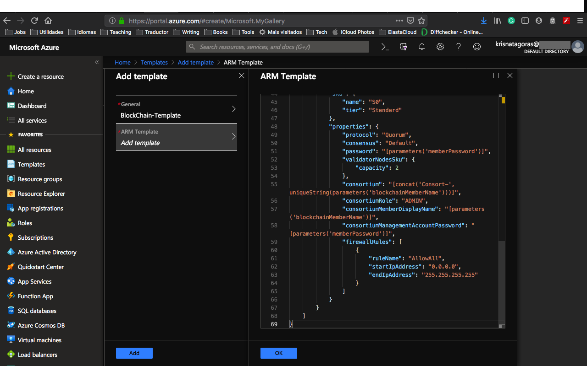

On ARM Template, replace the contents of the template with your template, and click on [OK].

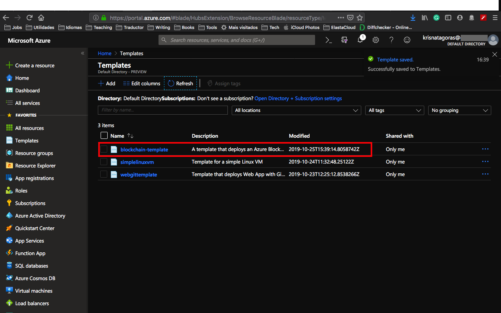

Click on the refresh button and you will find your template. Click on your template and then click in [Deploy]

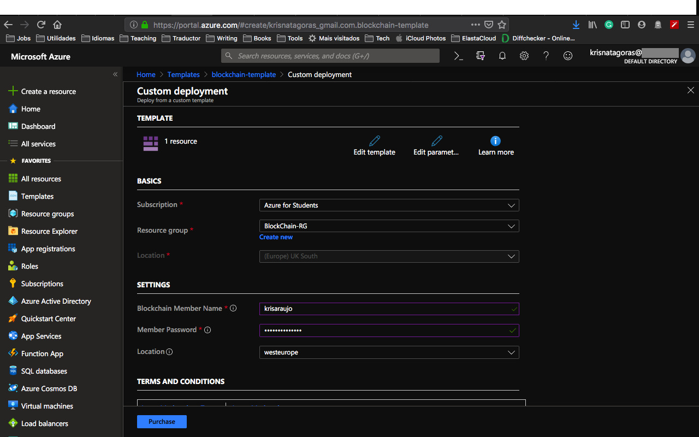

On the screen Custom Deployment, inform the values for the parameters, by now you must be already familiar with these.

Select [I agree] and click on [Purchase].

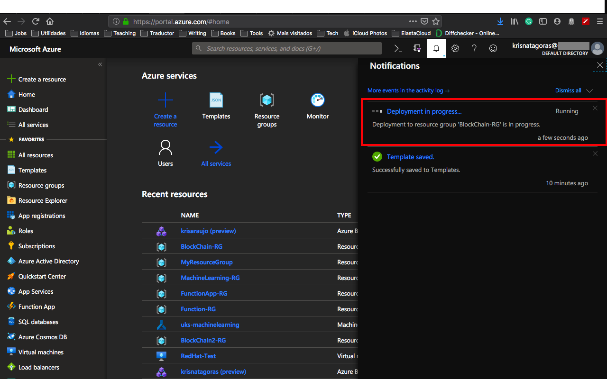

As you can see, it's deploying.

After a couple of minutes, voilà, you have your BlockChain Service deployed.

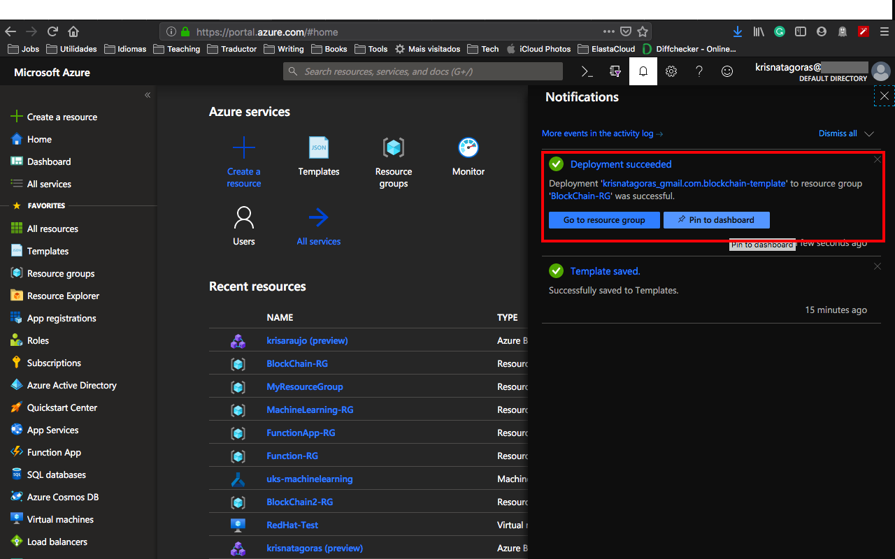

Go to the Resource. Repeat the test that you have done before.

**p.s.: It's pretty easy to create resources on Azure, right? But if you are the sort of IT guy that always loves automation, here is the surprise. Just click on the button below and it will automatically deploy the VM through the  Azure Portal.**

#### Important disclaimer: Azure charges you for the resources you are using, and you don't want to use all your credits at once, right? So, don't forget to stop the ___Service___ at the portal or even delete the Resource Group you have created to avoid unnecessary charges

### How to shutdown your resources

#### Using the portal

On the portal, open your Resource Group, if you will not use the BlockChain Service anymore, you can just click on the [Delete] Button.

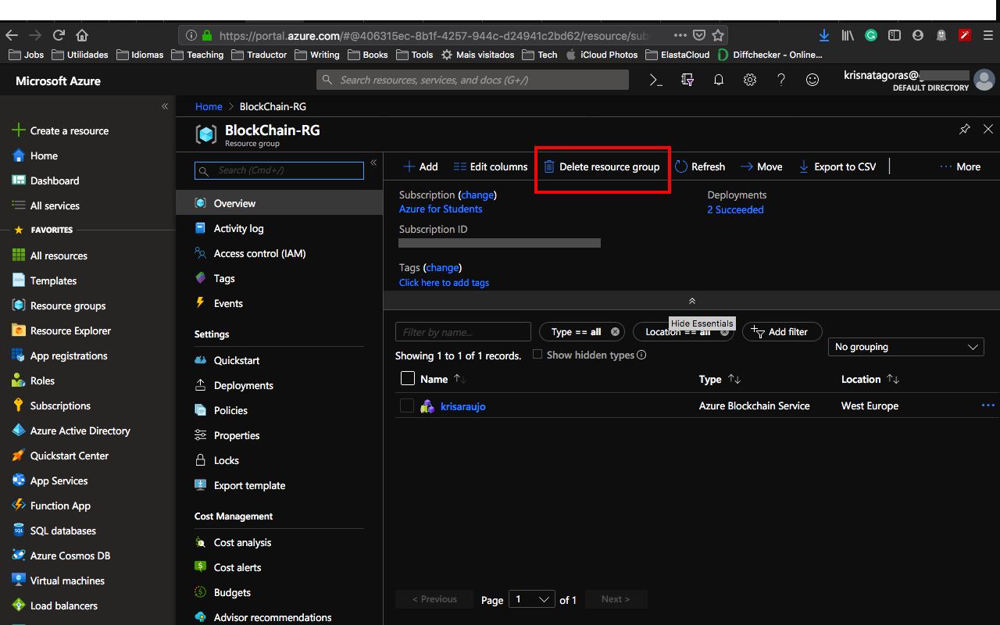

Just refresh your screen and you are good to go.
